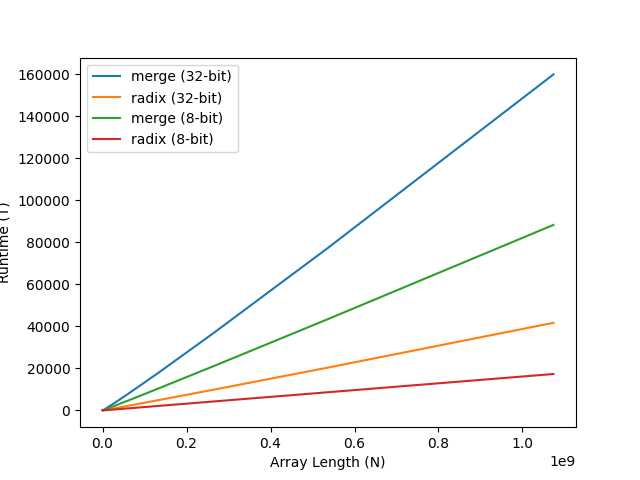

# Sorting Algorithm Comparison and Analysis

## Goals

In this experiment, I will be examining the real world scaling of
radix sort and merge sort. Both algorithms will be implemented in C++
and used on both sets of 8-bit integers and 32-bit integers. These sets of integers
will range from sizes of 2^1 to 2^30.

## Results

Here are the results of running the sorting algorithms on randomized arrays starting at N = 2^1 all the way to N = 2^30.
Above you can see a simple graph with linear scaling for x and y, and below you can see all the timing data in a fancy markdown table.

N           |  radix-TIME    |  radix32-TIME  |  merge-TIME    |  merge32-TIME
------------|----------------|----------------|----------------|---------------
2           |  0.228000      |  0.230000      |  0.023000      |  0.024000
4           |  0.060000      |  0.062000      |  0.005000      |  0.005000
8           |  0.060000      |  0.070000      |  0.004000      |  0.004000
16          |  0.058000      |  0.065000      |  0.005000      |  0.005000
32          |  0.065000      |  0.069000      |  0.008000      |  0.010000
64          |  0.065000      |  0.074000      |  0.012000      |  0.012000
128         |  0.072000      |  0.080000      |  0.025000      |  0.020000
256         |  0.082000      |  0.097000      |  0.042000      |  0.040000
512         |  0.093000      |  0.125000      |  0.088000      |  0.089000
1024        |  0.122000      |  0.173000      |  0.194000      |  0.192000
2048        |  0.185000      |  0.259000      |  0.421000      |  0.462000
4096        |  0.295000      |  0.440000      |  0.878000      |  0.993000
8192        |  0.519000      |  0.874000      |  1.811000      |  2.133000
16384       |  0.979000      |  1.552000      |  3.716000      |  4.512000
32768       |  1.884000      |  3.089000      |  5.252000      |  6.745000
65536       |  3.700000      |  4.566000      |  8.459000      |  10.285000
131072      |  5.025000      |  7.672000      |  11.196000     |  13.760000
262144      |  8.174000      |  10.485000     |  17.858000     |  24.581000
524288      |  10.841000     |  15.029000     |  35.959000     |  51.601000
1048576     |  16.527000     |  28.908000     |  73.455000     |  107.251000
2097152     |  32.867000     |  57.645000     |  148.582000    |  224.010000
4194304     |  65.241000     |  122.952000    |  302.831000    |  466.866000
8388608     |  130.442000    |  271.722000    |  615.611000    |  972.868000
16777216    |  262.098000    |  574.087000    |  1252.741000   |  2024.158000
33554432    |  528.160000    |  1184.097000   |  2549.118000   |  4202.456000
67108864    |  1064.633000   |  2419.303000   |  5178.394000   |  8720.535000
134217728   |  2145.543000   |  4922.080000   |  10529.147000  |  18076.416000
268435456   |  4315.325000   |  10005.499000  |  21392.694000  |  37418.750000
536870912   |  8646.464000   |  20381.668000  |  43468.269000  |  77373.655000
1073741824  |  17323.420000  |  41682.340000  |  88291.346000  |  159929.789000
